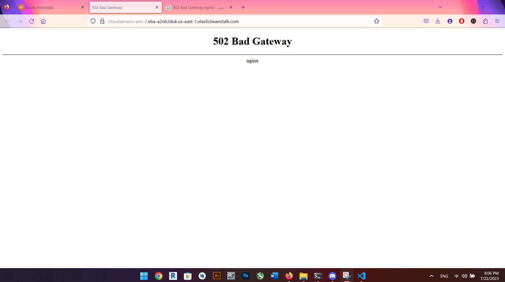

# cloud-server

## procces
1. i started the the aws service from canvas aws educational 
2. i created an envoirnment using beanstalk 
3. uploaded my web api app by compressing it to a zipfile. 
4. started the server on aws cloud service

# Url
http://cloudservero-env-2.eba-a2nb2duk.us-east-1.elasticbeanstalk.com/